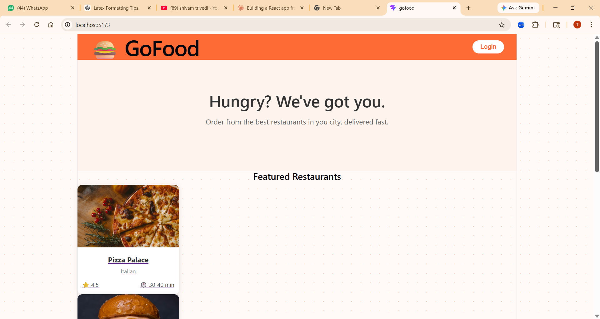
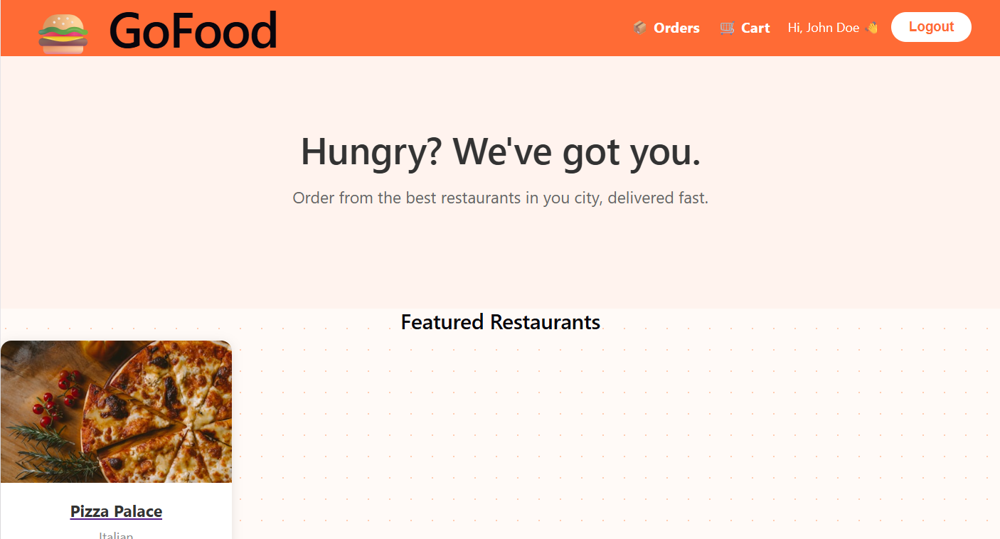
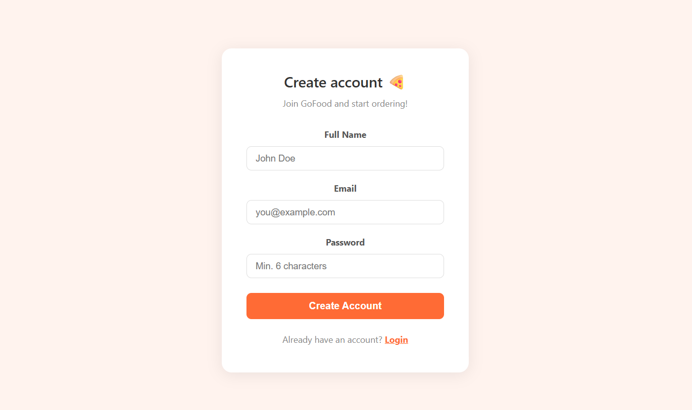
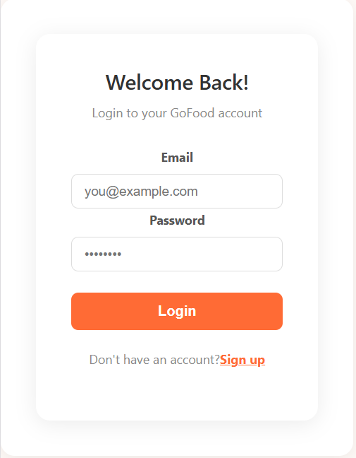
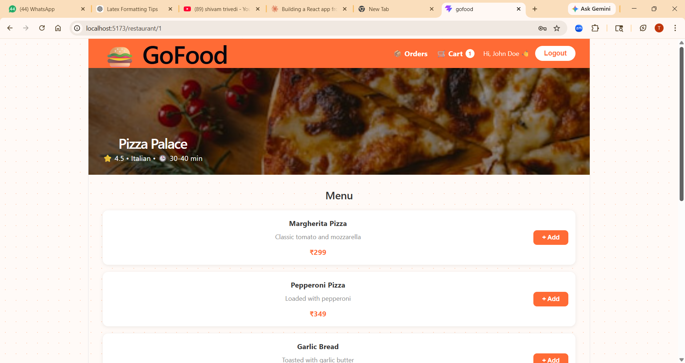
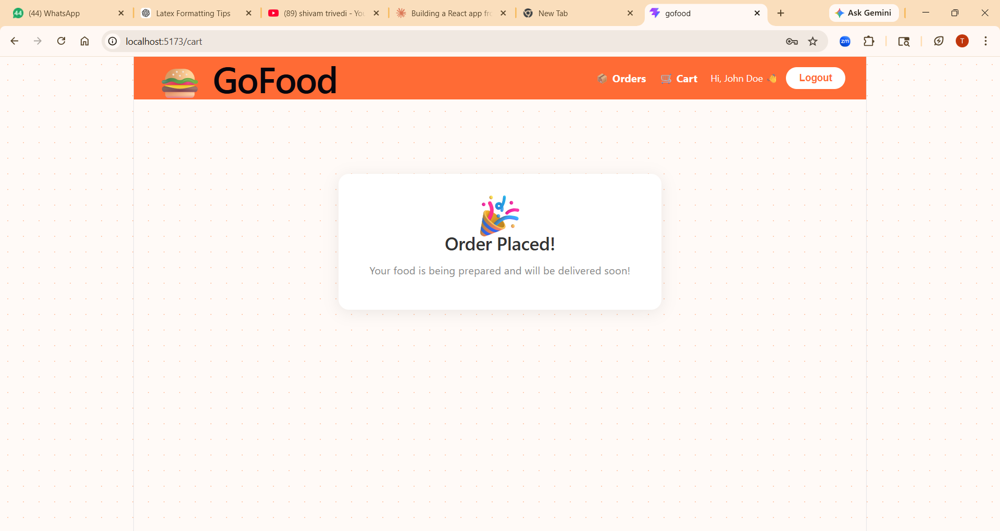
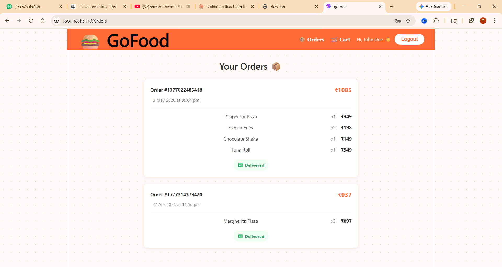
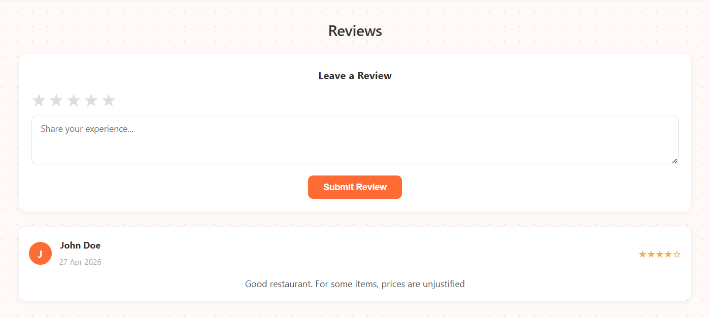

# 🍔 GoFood - Food Delivery App

A fully functional food delivery web application built with React. GoFood allows users to browse restaurants, explore menus, add items to cart, place orders and leave reviews.

> Built as a learning project to practice core React concepts including components, hooks, routing, context API and localStorage persistence.

---

## 📸 Screenshots

### 🏠 Landing Page (without logging in)


### 🏠 Landing Page (after logging in)


### 🔐 SignUp Page


### 🔐 Login Page


### 📋 Restaurant Menu


### 🛒 Cart


### 📦 Cart (after Order Placed)


### 📦 Order History


### ⭐ Ratings & Reviews


---

## ✨ Features

- 🔐 **User Authentication** — Signup and login with form validation. Credentials are persisted across sessions.
- 🍽️ **Restaurant Browsing** — Browse a curated list of restaurants with cuisine type, ratings and delivery time.
- 📋 **Menu Exploration** — Click any restaurant to explore its full menu.
- 🛒 **Cart Management** — Add items, adjust quantities, remove items and see a live running total.
- 📦 **Order History** — Every placed order is saved and accessible from the Orders page.
- ⭐ **Reviews System** — Logged in users can leave a star rating and written review for any restaurant.
- 💾 **Persistent State** — Cart, auth session, orders and reviews all survive page refreshes via localStorage.

---

## 🧠 React Concepts Covered

| Concept | Where it's used |
|---|---|
| Components & Props | Restaurant cards, menu items, navbar |
| `useState` | Forms, cart, reviews |
| `useEffect` | Persisting state to localStorage |
| `useContext` | Global auth, cart, orders, reviews state |
| React Router | Multi-page navigation |
| Dynamic Routes + `useParams` | Individual restaurant pages |
| Conditional Rendering | Login/logout UI, empty states |
| Lifting State Up | Cart shared across pages |
| Controlled Inputs | Signup, login, review forms |

---

## 🛠️ Tech Stack

- ⚛️ **React** — UI library
- ⚡ **Vite** — Build tool and dev server
- 🧭 **React Router DOM** — Client side routing
- 💾 **localStorage** — Data persistence (no backend yet)
- 🎨 **Inline Styles** — Component scoped styling

---

## 📁 Project Structure

src/
├── components/
│   ├── Navbar.jsx
│   ├── HeroSection.jsx
│   ├── RestaurantCard.jsx
│   ├── FeaturedRestaurants.jsx
│   └── ReviewSection.jsx
├── pages/
│   ├── LandingPage.jsx
│   ├── LoginPage.jsx
│   ├── SignupPage.jsx
│   ├── RestaurantPage.jsx
│   ├── CartPage.jsx
│   └── OrdersPage.jsx
├── context/
│   ├── AuthContext.jsx
│   ├── CartContext.jsx
│   ├── OrdersContext.jsx
│   └── ReviewsContext.jsx
└── data/
└── restaurants.js

---

## 🚀 Getting Started

### Prerequisites
- Node.js v18 or above
- npm

### Installation

```bash
# Clone the repository
git clone https://github.com/tanishede2809/GoFood.git

# Navigate into the project
cd GoFood

# Install dependencies
npm install

# Start the development server
npm run dev
```

Open [http://localhost:5173](http://localhost:5173) in your browser.

---

## 🗺️ Roadmap

- [ ] Connect to a real backend (Node.js + Express)
- [ ] Replace localStorage with MongoDB database
- [ ] Add real password hashing with bcrypt
- [ ] Add JWT based authentication
- [ ] Add search and filter for restaurants

---

## 👨‍💻 Author

Made with ❤️ and a lot of React debugging by **TANISH**

[](https://github.com/tanishede2809)

